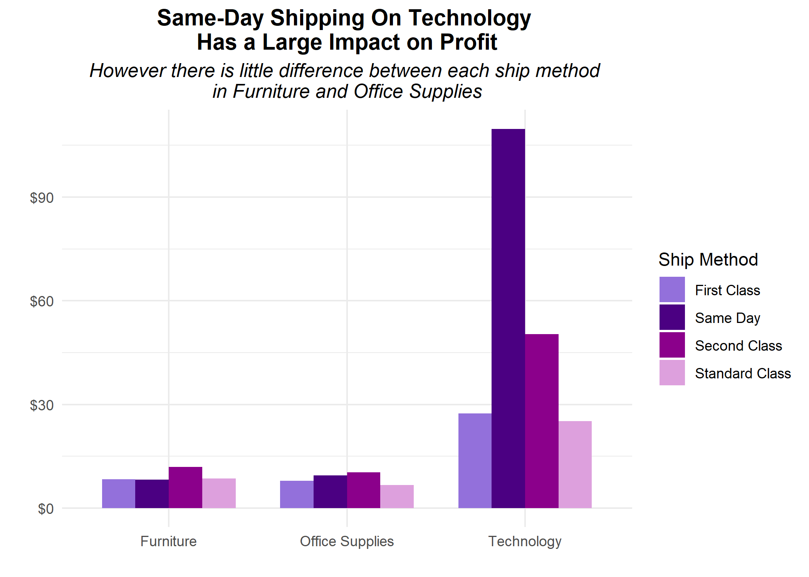
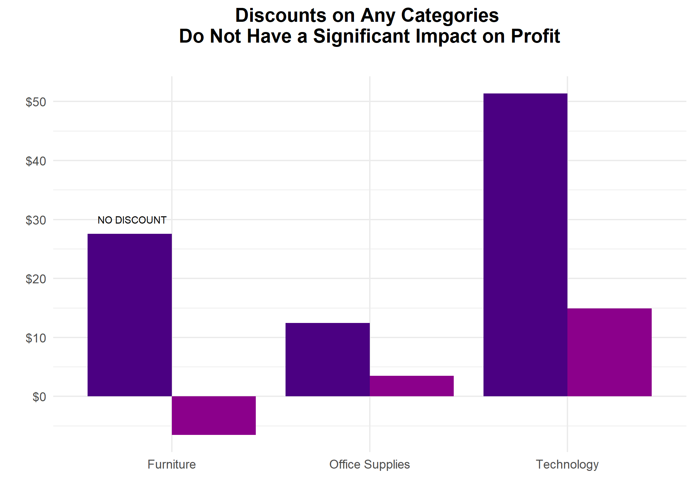

#### **To: Chris Lee**
#### **From: Thinh Mai**
#### **Date: 12/12/19**
#### **RE: OfficeMate Profitability**

***
```{r setup, include=FALSE}
knitr::opts_chunk$set(echo = TRUE)

```

```{r include = FALSE}
# Course: 5210 Data Visualization
# Purpose: Analyze on how to be more effective and strategic to improve profitability
# Date: December 12, 2019
# Authors: Thinh Mai

```

```{r include = FALSE}
setwd("C:/Users/Mai/Downloads")
od <- read.csv("Office_Data.csv") 

```

The old saying “Time is Money” holds even more truth in today’s on demand economy. As the name implies, same day delivery service occurs when goods are collected and delivered to customers within the same day. We are in a fast-moving era! Consequently, the order fulfillment industry faces new challenges seemingly every day. Often, these challenges are inspired by the practices initially adopted by ecommerce giants like Amazon, which customers then begin to expect from other retailers, including us. It is also crucial to understand how having reasonable discount offers could affect our company profit and sales targets in the long run. I was provided a sample of 9994 observations on daily online orders in the periods between January 1, 2012 and December 31, 2015, to better understand the current status of OfficeMate, then suggest on how to be more effective and strategic to improve profitability. In order to analyze better the data set, I created a few new variables to analyze such as cost, price per unit, profitable and order processing days. Cost is calculated by taking the revenue subtracted by the profit, while price is calculated by taking the revenue divided by the quantity ordered. 

I demonstrate my most crucial findings in the visuals and discuss them on-by-one below:

{width=600px} 

For my first finding, I investigated which category show an increase in profit when the shipping mode is same day compared to when shipping mode falls under first class, second class and standard class. I found that having same day shipping mode for Technology category makes the most difference in profit across all segments. The graph above shows the most likely profit generated for the same day shipping, on Technology. The reason for such a significant increase in profit could be due to numerous different things, but I narrowed it just to a few. Despite standard class ship mode (usually takes about 4 to 8 days for customers to receive their orders) is the most popular with the most orders, same day ship mode raises the most profit our company simply because it meets the customer expectations. Consumers are willing to pay more for the same-day delivery, especially for such important products in the Technology categories. By offering a fast and same-day delivery, we attract the customers and encourage them to place an order, which also explains the boost in our profit of technology due to the increase in sales volume. I also found another key finding that could help our company to be more effective in improving profitability, which I plan to talk about in my finding below. 

{width=600px}

For my second finding, I investigated the impact of discounts on profit of each category across all segments. The graph shows that even when discounts are offered, especially on Furniture, profit are not generated enough and even become negative. Overall, the increase in profit is due to not offering discounts. This is because when we offer a discount on an order, this amount then is deducted from the sell price. With a smaller sell price, obviously we are not able to create enough revenue to cover the product cost which leads to a negative amount in profit. This also means it does not matter if there is a discount for furniture, office supplies and technology or not, people will still buy it and our company still has profit. 

Originally adopted by Amazon and other online retailers, same-day shipping or even two-hour shipping have become the norm for much of the industry and we need to keep up with it to meet the increased demands as well as expectations from our customers. On the other hand, our company are not benefitting much from offering discounts on our products, and even suffered losses from it. In order to improve profitability, OfficeMate should decrease their efforts for offering percentage discounts on all products, and up for quantity discounts or bundle stock instead. More importantly, they can take advantage of the same-day shipping and use the discount budget to offer free same-day shipping instead to attract new customers and keep customer retention. As for the ship mode factor, since we are doing so well for technology category, we need to shift that focus to other categories to get the same result. Further analysis can be done if I have more information on certain variables. For example, it would be very helpful to know the cost of the same-day shipping to analyze how much it is included in the actual cost, so that we can set a more suitable price. Additionally, knowing which customers place the most orders would help to see what we could do differently to attract more customers in the same segments or from other segments and locations. 

Please do not hesitate to contact me if you have any questions or would like to discuss the analysis further, it is best to reach me at tmai@seattleu.edu. I can also provide the Technical Appendix with my complete analysis and the data if you would like more detail.

Sincerely,

Thinh Mai


